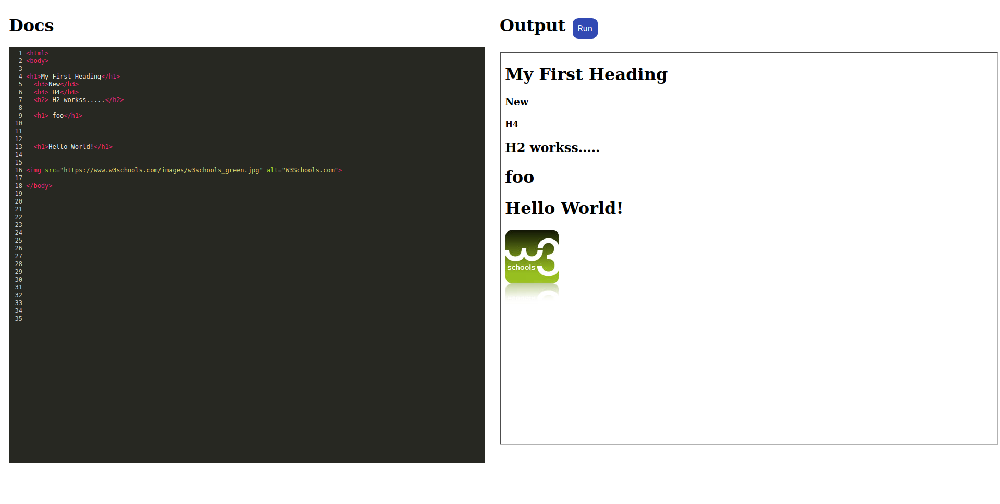
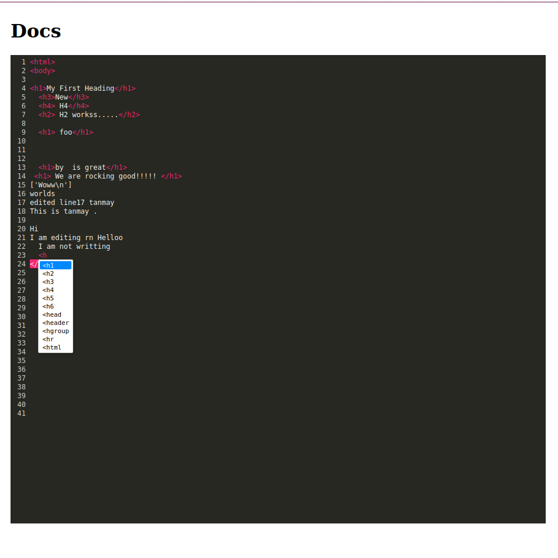
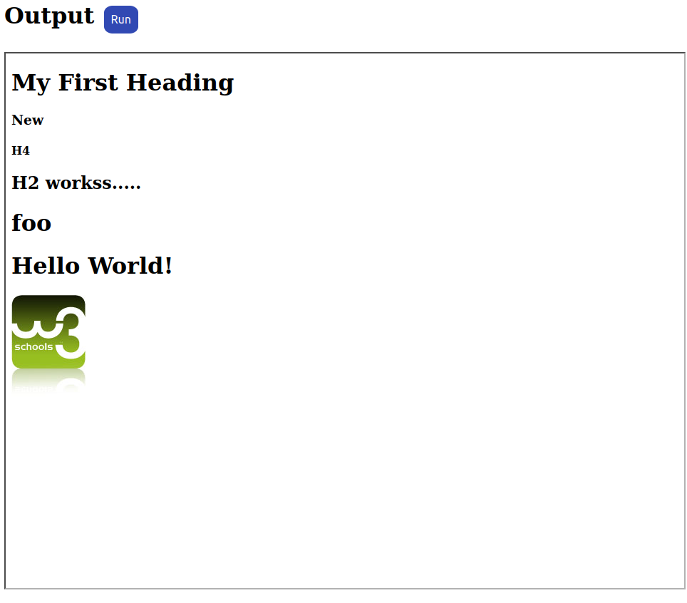

# OS-WebServer

A multithreaded online IDE for pair-programming built using Operating Systems concepts. 

# Instructions to Run

## Running the server:

1. Clone the repo.
2. Run the `make` command.
3. If you got no compilation errors then you can run `./web_server`.

## Testing using ngrok:

1. Run `./ngrok/ngrok/ http 18000`.
2. Using the link obtained, head over to `<link>/mirror.html` to view the IDE.

## Run unit tests:

1. Run `python test_single_vs_multi.py` for comparison between single-threaded and multi-threaded server.
2. Run `python test_multiple_reader.py` for simulating many readers.
3. Run 'python write_test.py` for simulating many writers.
4. Run `python read_write_test.py` for simulating cycles of readers and writers.

# Exposed APIs:

- `http://localhost:18000/` to view Reader-Writer.
- `/reader?line_num={line_num}` api for reader to read line number: `line_num`.
- `/writer?line_num={line_num}&content={content}` for writer to edit the line number: `line_num` by `content`.
- `/docs_writer?line_num={line_num}&content={content}` same as above.
- `/docs_reader` read all the content of the `data.txt` file.

# Changes to make while editing the codebase

1. Add the new file in `Makefile`, if any.
2. Keep standard libraries in `*.h` header files.
3. Use similar code format throughout the whole codebase (Use VS Code standard format support: `Ctrl + Shift + I`).
4. Use meaningful variable names.
5. Before pushing the code make sure your are on the upstream and avoid doing force push unless necessary.
6. Add executable files (like `web_server`) in `.gitignore`.

# Demo

1. UI

2. Autocomplete feature ans syntax highlighter

3. HTML execution output

## Contributors
- [Akshat](https://github.com/akshatdalton)
- [Tanmay Khabia](https://github.com/tkhabia)
- [Dipanwita Guhathakurta](https://github.com/susiejojo)

Made with ❤️️ as part of the course Algorithms and Operating Systems, Monsoon '21.
